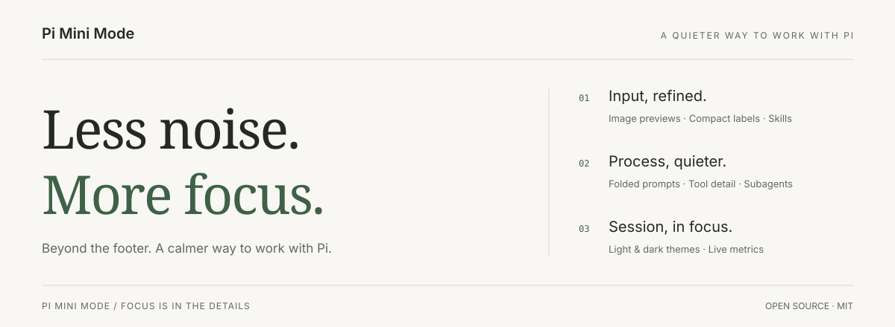
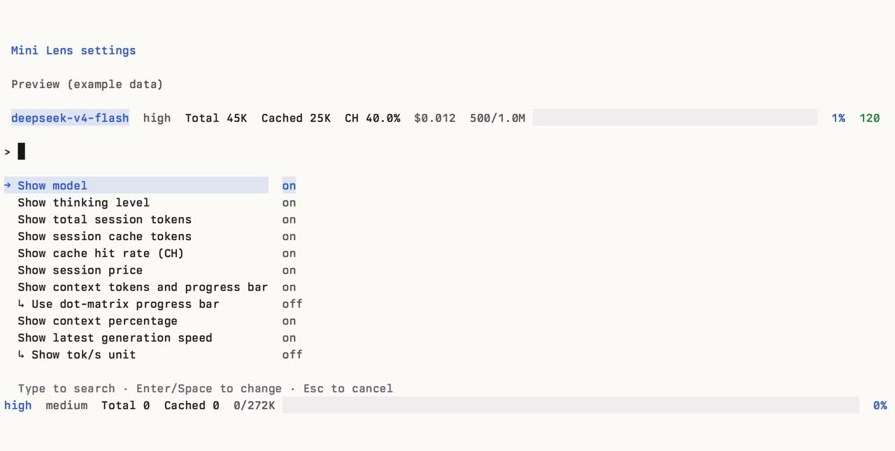

<p>
  
</p>

[中文](README.zh-CN.md) · [Install](#install) · [Features](#features) · [Commands](#commands) · [Reference](#reference)

# Pi Mini Mode

**Less noise. More focus.**

An everyday refinement for [Pi](https://pi.dev), not just a footer. Preview images at the cursor, fold long messages and process details, inspect subagent work, and keep your session’s essential signals in view.


https://github.com/user-attachments/assets/cd972993-a6f9-4399-81a6-6e0d540dec9a


## Install

```bash
pi install npm:@each1024/pi-mini-mode
```

Run `/reload` in Pi. On the first interactive TUI session, choose **Apply recommended setup** to select `cc-dark` or `cc-light` and save the theme plus `tuiMode=fullscreen` globally; restart Pi for fullscreen to take effect. Project settings and CLI flags may override global settings. You can configure Pi Mini Mode any time with `/pi-mini-mode-settings`.

**Pi ≥ 0.84.0.** Input enhancements and minimal output are on by default. Minimal mode uses a private **Pi 0.85.x** layout adapter—see [compatibility](#compatibility) before enabling it.

<details>
<summary>Install from GitHub instead</summary>

```bash
pi install git:github.com/eachann1024/pi-mini-mode
```

</details>

## Features

### 01 / Input, refined

**Images at your cursor.** Move the editing cursor into an image path or compact label to preview it. Fullscreen also supports editor hover. Press `Esc` to dismiss.

**Less path clutter. Same image.** Image paths become underlined `[image1]` labels in the editor and messages, preserving the original path when submitted. Open the original image or another linked file in its default app using your terminal’s link gesture.

**Skills where you type.** Enter `/` at the start or after whitespace to find a skill and insert `/skill:name` at the cursor. Inline skills expand on submission; URLs and paths keep their normal behavior.

Paste images with `Ctrl+V` (`Alt+V` on Windows/WSL). Disabling input enhancements preserves Pi’s native clipboard behavior.

### 02 / Process, quieter

Enable **Minimal output** in `/pi-mini-mode-settings`.

- **Long prompts, folded.** In fullscreen minimal mode, long user messages show the first four rendered rows. Click the fold control to reveal the rest. Complete fenced code blocks stay intact.
- **Subagents, in plain sight.** Click a subagent row to expand its available activity and message/final output. A dispatch receipt or returned tool call is not a completed background task.
- **A process tree, not a wall of output.** Thinking, tools and skill reads share one chronological tree. The latest summaries stay visible, including the latest thinking; `Ctrl+O` expands or collapses the full process. New questions start collapsed.
- **Tool details on demand.** Expand a tool or thinking entry, including the latest thinking, using its fold control. Thinking starts collapsed and only expands or collapses manually, including while running. Tool details show saved text, not the original custom renderer or image output.
- **Room for the answer.** Final Markdown streams without extra headings or backgrounds. Failures and interruptions stay explicit. Folding changes presentation, not stored session messages.

Turn **Minimal output** off in settings to restore native Pi history.

### 03 / Session, in focus

**Light and dark, considered.** Includes `cc-light` and `cc-dark`, derived from [pi-cc-extensions](https://github.com/minuque/pi-cc-extensions) under MIT. User messages use the theme’s user-message surface; Markdown, highlighted code, tables and supported Mermaid diagrams adapt to the theme. Unsupported, incomplete or over-wide diagrams retain their source.

**The useful signals, in one line.** Model and thinking level, session tokens, cache totals and hit rate, estimated cost, context usage and generation speed. Choose your fields in `/pi-mini-mode-settings`; changes take effect immediately, and the footer adapts to narrow terminals.

<details>
<summary>See the footer settings and demo</summary>

[](assets/pi-mini-mode-settings.jpg)

[Watch the footer settings demo](https://github.com/user-attachments/assets/5f2f4816-45ed-4759-b035-d9ee59e8a763)

This earlier screenshot and recording show footer configuration, not the newer image, folding or subagent features. Settings previews use sample data.

</details>

## Commands

| Command / shortcut | Purpose |
| --- | --- |
| `/pi-mini-mode-settings` | Configure fields, input enhancements and minimal output |
| `Ctrl+O` | Expand or collapse the complete process tree |
| `Ctrl+S` | Expand or collapse completed subagent rows; yields to Pi `/model`, `/thinking`, and other selectors |
| `/reload` | Reload the extension after installation or source changes |

Subagent rows have their own click-to-expand control; supported third-party widgets retain native detail shortcuts.

## Compatibility

- **Images:** previews require a terminal image protocol; unsupported terminals show a hint. Image reads are limited to **20 MB**, and deleted files cannot be reopened. Link gestures depend on the terminal: usually `Cmd+click` on macOS or `Ctrl+click` on Windows/Linux; Ghostty fullscreen may require `Shift+Cmd` / `Shift+Ctrl`. Pi fullscreen also supports direct link clicks. See [Pi terminal setup](https://github.com/earendil-works/pi-mono/blob/main/packages/coding-agent/docs/terminal-setup.md).
- **Minimal output:** uses a private Pi 0.85.x layout adapter without patching Pi’s installation. Unknown layouts refuse activation and keep native output. Recheck after Pi upgrades; other transcript-replacing extensions can conflict.
- **Subagents:** the pi-subagents widget adapter runs only in minimal mode, restores on disable, and passes unknown formats through. Available details depend on the integration’s status/output data; this is not a complete subagent transcript viewer.
- **History:** `/reload` remounts the transcript, including history created in native mode. Empty progress events do not erase existing content; tools without output show elapsed waiting time. Legacy per-item minimal controls no longer filter content.
- **Metrics:** costs are estimates, not provider invoices. See the calculation details below.

## Reference

<details>
<summary><strong>First run & configuration</strong> — defaults, controls, and settings file</summary>

On the first interactive TUI session, Pi Mini Mode shows a preview. Almost every feature is on by default; only **branch-only** is off (it is mutually exclusive with **project & branch**). Change anything later with `/pi-mini-mode-settings`.

```text
deepseek-v4-flash  high  Total 45K  Cached 25K  CH 40.0%  $0.012  ◇ MCP 3  500/1.0M  ⣿⣀⣀⣀⣀⣀⣀⣀⣀⣀  1%  120 tok/s
```

The first-run picker offers **Keep defaults**, **Configure now**, and **Apply recommended setup**. Keeping defaults saves the default field selection, leaves minimal output on, and prevents the prompt from appearing again; configuring opens the same settings list immediately. Applying the recommendation asks you to choose the bundled `cc-dark` or `cc-light` theme, saves that theme and global `tuiMode=fullscreen` through Pi's settings API, applies the theme immediately, and asks you to restart Pi because the fullscreen renderer is chosen at startup. Project settings and CLI flags may override these global values. Escape/cancel leaves onboarding incomplete; it runs again on the next interactive session. Print, JSON, and other non-interactive modes never prompt.

Open that settings UI any time with:

```text
/pi-mini-mode-settings
```

The focused option and its corresponding preview field use bold theme `accent` text with a `selectedBg` background. Fullscreen Pi supports hover to focus and click to toggle; regular terminal mode uses keyboard navigation. Hovering never changes a setting.

Changes take effect immediately. The command requires Pi's TUI mode. Its preview always uses fixed example data rather than your current session, while reflecting every setting toggle immediately.

Settings are stored globally at Pi's agent directory (normally `~/.pi/agent/pi-mini-mode.json`; installations with a different Pi config directory use that directory). A malformed or missing file safely falls back to the defaults.

```json
{
  "pi-mini-mode-model-show": true,
  "pi-mini-mode-thinking-show": true,
  "pi-mini-mode-ch-show": true,
  "pi-mini-mode-session-tokens-show": true,
  "pi-mini-mode-cache-tokens-show": true,
  "pi-mini-mode-cost-show": true,
  "pi-mini-mode-mcp-show": true,
  "pi-mini-mode-context-show": true,
  "pi-mini-mode-context-dots-show": true,
  "pi-mini-mode-context-percent-show": true,
  "pi-mini-mode-speed-show": true,
  "pi-mini-mode-speed-unit-show": true,
  "pi-mini-mode-minimal-show": true,
  "pi-mini-mode-input-enhancements": true,
  "onboardingCompleted": true
}
```

| Key | Default | Controls |
| --- | --- | --- |
| `pi-mini-mode-model-show` | `true` | Model ID without provider prefix |
| `pi-mini-mode-thinking-show` | `true` | Thinking level |
| `pi-mini-mode-ch-show` | `true` | Session cache-hit rate (`CH`) |
| `pi-mini-mode-session-tokens-show` | `true` | Accumulated session tokens (`Total`) |
| `pi-mini-mode-cache-tokens-show` | `true` | Accumulated cache read + cache write tokens |
| `pi-mini-mode-cost-show` | `true` | Estimated session list price |
| `pi-mini-mode-mcp-show` | `true` | Enabled MCP server count |
| `pi-mini-mode-context-show` | `true` | Used/total context tokens and progress bar |
| `pi-mini-mode-context-dots-show` | `true` | Use a single-line dot-matrix bar instead of the solid bar |
| `pi-mini-mode-context-percent-show` | `true` | Context-use percentage |
| `pi-mini-mode-speed-show` | `true` | Generation speed at the far right |
| `pi-mini-mode-speed-unit-show` | `true` | Generation-speed sub-setting: append `tok/s` to the numeric value |
| `pi-mini-mode-minimal-show` | `true` | Minimal output; off restores Pi's default conversation history |
| `pi-mini-mode-input-enhancements` | `true` | Image previews, inline skills, and message file links |
| `onboardingCompleted` | `false` initially | Internal marker that prevents another first-run prompt |

- **Generation speed**
  - **Show tok/s unit** (`pi-mini-mode-speed-unit-show`) is the indented sub-setting shown beneath **Show latest generation speed** in `/pi-mini-mode-settings`. Turning it off keeps the speed number (for example `40.0`) and removes only `tok/s`.
  - The sub-setting is retained when generation speed itself is hidden.

</details>

<details>
<summary><strong>How metrics work</strong> — tokens, cache, speed, and estimated price</summary>

Session totals are aggregated from each finalized `assistant` and `toolResult` entry on the active session branch. This includes nested LLM work reported by tools (such as a child agent) exactly once. `Total` uses the provider's `totalTokens` when supplied; older/custom results without it fall back to the sum of input, output, cache-read, and cache-write tokens. `Cached` is cache-read + cache-write (included in Total); `CH` is cache-read / (input + cache-read). Only persisted finalized usage is counted, so stream updates cannot double count totals.

During an assistant stream, speed is decode TPS: provider `usage.output` divided by elapsed time from the first output token, excluding TTFT/prefill wait. It appears after at least two output tokens and 100ms of decode time, and is refreshed while streaming. The completed rate remains visible while later assistant messages only call tools or wait for output; it is replaced only by a newer measurable main-turn generation. Nested tool LLM usage does not overwrite a measured main-turn rate; it can set the footer only when no main generation has been measured yet. Short or single-token bursts are hidden rather than shown as inflated tok/s. Regressing output samples and non-increasing timestamps are ignored.

Before a measurable response exists, the speed field is absent entirely—Pi Mini Mode never displays a `-- tok/s` placeholder. When present, speed is the rightmost footer field (the context percentage, if enabled, is immediately to its left). Its color uses Pi theme semantics: **success** at >=30 tok/s, **warning** at 10–29.9 tok/s, and **error** below 10 tok/s. No colors are hard-coded, so it follows the selected Pi theme.

The price is the same finalized active-branch usage and configured per-million-token rates. It is an estimate, not a provider invoice. In narrow terminals, the footer drops/truncates lower-priority content to remain one line without overflow.

</details>

<details>
<summary><strong>Development</strong> — local setup and checks</summary>

Install only the local copy while developing; installing npm and local copies together double-registers the extension:

```bash
pi remove npm:@each1024/pi-mini-mode && pi install /path/to/pi-mini-mode
npm run check
npm test
```

After source changes, run `/reload` in an already-open Pi session. `npm run check` runs TypeScript checking and `npm test` runs the project self-checks.

For a real terminal smoke test, run `python3 test/minimal-pty.py`. It needs Python 3, Node, and the installed dependency’s bundled Pi CLI. Temporary fixtures cover regular/fullscreen output, toggling, process expansion, restored results, and narrow terminals without model calls.

</details>

<details>
<summary><strong>Publishing</strong></summary>

Normal releases are published from this machine with the npm token in `.npmrc` (`npm publish --access public`). `publish.yml` is only a manual backup (`workflow_dispatch` on `main`): it runs `npm ci`, `npm run check`, and `npm test`, then `scripts/publish.mjs`. That script publishes the higher of the local version baseline and npm's latest stable version plus one patch, changes the version only in the runner (no version commit or tag), and skips commits that are already published. Raise the baseline in `package.json` and the lockfile for a major or minor release.

The backup workflow needs the package’s npm Trusted Publisher configured for this GitHub repository and `publish.yml`. It uses OIDC and provenance and does not use an npm token.

</details>

<details>
<summary><strong>Collaboration guidance</strong></summary>

The main session owns requirement alignment, risk research, the complete solution, task scheduling, key decisions, integration, and the final summary. Before implementation, it should investigate the key risks, boundaries, acceptance criteria, and solution. Once authorized, use subagents aggressively and parallelize independent work to save time, while respecting relevance, risk, budget, concurrency, and single-writer constraints. Use the `low` model by default for most tasks and subagents; upgrade only for complex reasoning, key decisions, or risk reviews when necessary.

</details>

---

[MIT License](LICENSE) · Built for [Pi](https://pi.dev)
