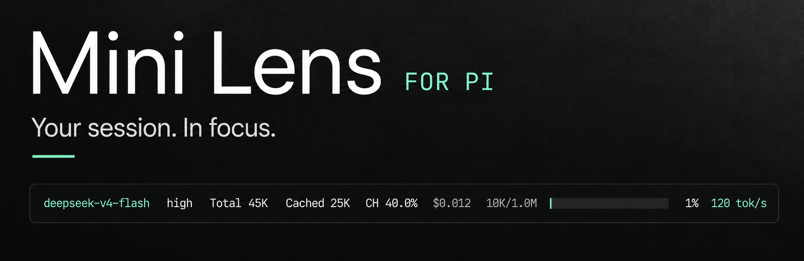

# Pi Mini Mode for Pi（中文）

[English](README.md)

<p align="center">
  
</p>

<p align="center">
  <a href="#安装">安装</a> · <a href="#按需配置">配置</a> · <a href="https://github.com/user-attachments/assets/5f2f4816-45ed-4759-b035-d9ee59e8a763">观看演示</a> · <a href="README.md">English</a>
</p>

适用于 [Pi](https://pi.dev) 的紧凑、可配置页脚。模型、用量、费用估算、上下文使用率和生成速度，一眼即可查看。

## 极简输出

`/pi-mini-mode-settings` 现在包含 **Lens**、独立的 **Collapse replies（折叠回复）** 和 **Minimal output（极简输出）** 设置。折叠回复默认关闭；关闭时，极简输出选项也会禁用，因此 Pi 的对话历史会保持原生显示。

- `/pi-mini-mode-minimal on` 显示带主题色背景的用户 Markdown、无背景的过程摘要，以及没有标题或额外背景的最终回复，不会重复显示停靠面板。
- 每轮使用一棵共享树，显示最新 **10 条摘要**，包括可用的思考、工具调用、流式工具输出和技能读取。按 `Ctrl+O` 可展开完整 Markdown 过程，再按一次收起；新问题默认收起。没有输出的工具会显示已等待时间，空的进度事件不会覆盖已有内容，也不会显示分组标题、折叠数量或完成标签。原始会话消息保持不变。
- Agent/subagent 调用会按时间顺序与工具、技能共用同一棵树；按 `Ctrl+O` 可查看任务和 Markdown 输出。调用返回并不代表后台任务已经完成。
- pi-subagents 的 `async subagent` / `Async agents` 小组件使用无背景的状态树，同时保留原生详情快捷键和输出路径。此适配器只在极简模式启用，关闭后恢复原状，未知格式会直接交给原生处理。分组设计参考 [pi-cc-extensions](https://github.com/minuque/pi-cc-extensions)。
- `/pi-mini-mode-history` 可浏览完整过程记录，每次显示 5 条。
- 最终 Markdown 会随着文本事件流式显示；失败和中断会明确标记。
- `/reload` 会重新挂载 transcript，也会包含原生模式中产生的历史记录。展开状态的树形连接线会贯穿段落、空行和代码块。
- `/pi-mini-mode-minimal off` 恢复 Pi 默认的对话历史显示。

用户区域会混合当前 Pi 强调色与用户背景色。过程和回答文本没有背景；用户区域水平方向留出两个终端列、垂直方向留出一行。Markdown、高亮代码、表格以及 Mermaid 终端图表可适配明暗主题；不完整、不支持或过宽的图表会保留源文本。

极简模式使用私有的 Pi 0.85.x 布局适配器，不会修改 Pi 安装目录。未知布局会拒绝启用并保留原生输出。升级 Pi 后请重新检查兼容性；如果其他扩展也替换 transcript，可能产生冲突。

## 安装

```bash
pi install npm:@each1024/pi-mini-mode
```

在 Pi 中运行 `/reload`。需要 **Pi ≥ 0.84.0**。

也可以直接从 GitHub 安装：

```bash
pi install git:github.com/eachann1024/pi-mini-mode
```

## 页脚指标与配置

默认显示：

- 模型与思考级别
- 会话令牌总数
- 缓存令牌与命中率
- 会话费用估算
- 上下文用量与进度条
- 最新生成速度

运行以下命令即可配置显示字段，修改立即生效，并会按照当前 Pi 主题预览：

```text
/pi-mini-mode-settings
```

页脚会跟随 Pi 主题并适配窄终端。只有页脚会变化，Pi 内置的工具和思考视图保持不变。内置的 `cc-light` / `cc-dark` 主题来自 [pi-cc-extensions](https://github.com/minuque/pi-cc-extensions)，采用 MIT 许可。

首次进入交互式 TUI 会话时，Pi Mini Mode 默认启用所有字段并显示预览，例如：

```text
deepseek-v4-flash  high  Total 45K  Cached 25K  CH 40.0%  $0.012  500/1.0M  █░░░░░░░░░  1%  120 tok/s
```

首次设置会提供 **Keep defaults（保留默认值）** 和 **Configure now（立即配置）**。保留默认值会保存页脚字段、保持折叠回复关闭，并且不再显示首次设置提示；立即配置会直接打开同一设置列表。Print、JSON 等非交互模式不会显示提示。

设置保存在 Pi 的 agent 目录中，通常是 `~/.pi/agent/pi-mini-mode.json`；如果 Pi 使用其他配置目录，则保存在对应目录。文件缺失或格式错误时会安全回退到默认设置。设置示例：

```json
{
  "pi-mini-mode-model-show": true,
  "pi-mini-mode-thinking-show": true,
  "pi-mini-mode-ch-show": true,
  "pi-mini-mode-session-tokens-show": true,
  "pi-mini-mode-cache-tokens-show": true,
  "pi-mini-mode-cost-show": true,
  "pi-mini-mode-mcp-show": false,
  "pi-mini-mode-context-show": true,
  "pi-mini-mode-context-dots-show": false,
  "pi-mini-mode-context-percent-show": true,
  "pi-mini-mode-speed-show": true,
  "pi-mini-mode-speed-unit-show": true,
  "onboardingCompleted": true
}
```

| 配置项 | 默认值 | 说明 |
| --- | --- | --- |
| `pi-mini-mode-model-show` | `true` | 显示不含 provider 前缀的模型 ID |
| `pi-mini-mode-thinking-show` | `true` | 显示思考级别 |
| `pi-mini-mode-ch-show` | `true` | 显示会话缓存命中率（`CH`） |
| `pi-mini-mode-session-tokens-show` | `true` | 显示会话累计令牌（`Total`） |
| `pi-mini-mode-cache-tokens-show` | `true` | 显示缓存读取与写入令牌（已包含在 Total 中） |
| `pi-mini-mode-cost-show` | `true` | 显示会话费用估算 |
| `pi-mini-mode-mcp-show` | `false` | 显示已启用的 MCP 服务器数量 |
| `pi-mini-mode-context-show` | `true` | 显示已用/总上下文令牌和进度条 |
| `pi-mini-mode-context-dots-show` | `false` | 使用单行点阵进度条替代默认实心进度条 |
| `pi-mini-mode-context-percent-show` | `true` | 显示上下文使用百分比 |
| `pi-mini-mode-speed-show` | `true` | 显示最新生成速度 |
| `pi-mini-mode-speed-unit-show` | `true` | 速度子设置：在数字后追加 `tok/s` |
| `pi-mini-mode-minimal-show` | `false` | 折叠回复；关闭则使用 Pi 默认历史显示 |
| `pi-mini-mode-minimal-thinking-show` | `true` | 显示折叠回复中的思考 |
| `pi-mini-mode-minimal-tools-show` | `true` | 显示工具调用和 Agent 调用 |
| `pi-mini-mode-minimal-output-show` | `true` | 显示过程输出 |
| `pi-mini-mode-minimal-skills-show` | `true` | 显示技能读取 |
| `pi-mini-mode-agent-usage-show` | `true` | 显示 Agent token 用量 |
| `pi-mini-mode-agent-shortcut-show` | `true` | 新 Agent 显示临时 `Ctrl+O` 提示 |
| `onboardingCompleted` | 初始为 `false` | 防止再次显示首次设置提示的内部标记 |

生成速度设置中的 **显示 tok/s 单位** 是 **显示最新生成速度** 下方的缩进子设置。关闭它只会移除 `tok/s`，保留速度数字；即使隐藏生成速度，该子设置仍会保留。

## 指标如何计算

会话总量来自当前会话分支中每一条已完成的 `assistant` 和 `toolResult` 记录。工具报告的嵌套 LLM 工作（例如子 Agent）会准确计入一次。若 provider 提供 `totalTokens`，`Total` 使用该值；较旧或自定义结果没有该字段时，则使用输入、输出、缓存读取和缓存写入令牌之和。`Cached` 是缓存读取与写入之和（包含在 `Total` 中）；`CH` 是缓存读取量除以输入量与缓存读取量之和。只有已持久化的最终用量会计入，因此流式更新不会重复累计。

助手生成过程中，只要有正数的累计 `usage.output` 样本和可用耗时，就会显示速度，并持续刷新。速度等于输出令牌数除以助手消息开始后的耗时。后续助手消息如果只是调用工具或等待输出，之前完成的速度仍会保留；只有新的可测量生成才会替换它。倒退的输出样本和不递增的时间戳会被忽略。工具结果若报告嵌套 LLM 用量但没有流事件，则使用输出令牌数除以工具执行时长计算最终速度；无法报告输出用量的工具不会产生速度，也不会清除之前的速度。

在获得可测量响应前，速度字段完全不显示，不会出现 `-- tok/s` 占位符。速度位于页脚最右侧；启用上下文百分比时，百分比紧邻其左侧。颜色遵循 Pi 主题语义：至少 30 tok/s 为成功色，10–29.9 tok/s 为警告色，低于 10 tok/s 为错误色。费用是基于当前分支已完成用量和配置的每百万令牌费率得出的估算，并非 provider 账单。窄终端中，页脚会丢弃或截断优先级较低的内容，确保保持单行且不溢出。

## 开发与检查

开发时只安装本地副本；同时安装 npm 版本和本地版本会导致扩展重复注册：

```bash
pi remove npm:@each1024/pi-mini-mode && pi install /path/to/pi-mini-mode
npm run check
npm test
```

修改源码后，在已打开的 Pi 会话中运行 `/reload`。`npm run check` 会执行 TypeScript 检查，`npm test` 会执行页脚、设置和发布自检。真实终端冒烟测试：

```bash
python3 test/minimal-pty.py
```

该测试需要 Python 3、Node 以及已安装依赖中自带的 Pi CLI；会使用临时 fixture，覆盖普通/全屏模式、切换、10 条过程记录、`Ctrl+O` 展开/收起、恢复结果和窄终端，不会调用模型。

## 发布

推送到 `main` 后，GitHub Actions 会在通过 `npm ci`、`npm run check` 和 `npm test` 后自动发布到 npm；也支持在 `main` 上手动触发。每次发布都会取本地版本基线与 npm 最新稳定版本加一个 patch 中的较高者。版本只在 runner 中变更，不创建版本提交或 tag；发布 major/minor 版本时，应同时提高 `package.json` 和 lockfile 中的基线。已经发布过的提交会跳过。Actions 并发策略可能替换等待中的推送，因此不是每次推送或一次推送中的每个提交都保证生成独立版本。

后续发布使用 npm Trusted Publisher、OIDC 和 provenance，无需 npm token。

---

[MIT License](LICENSE) · 为 [Pi](https://pi.dev) 打造
